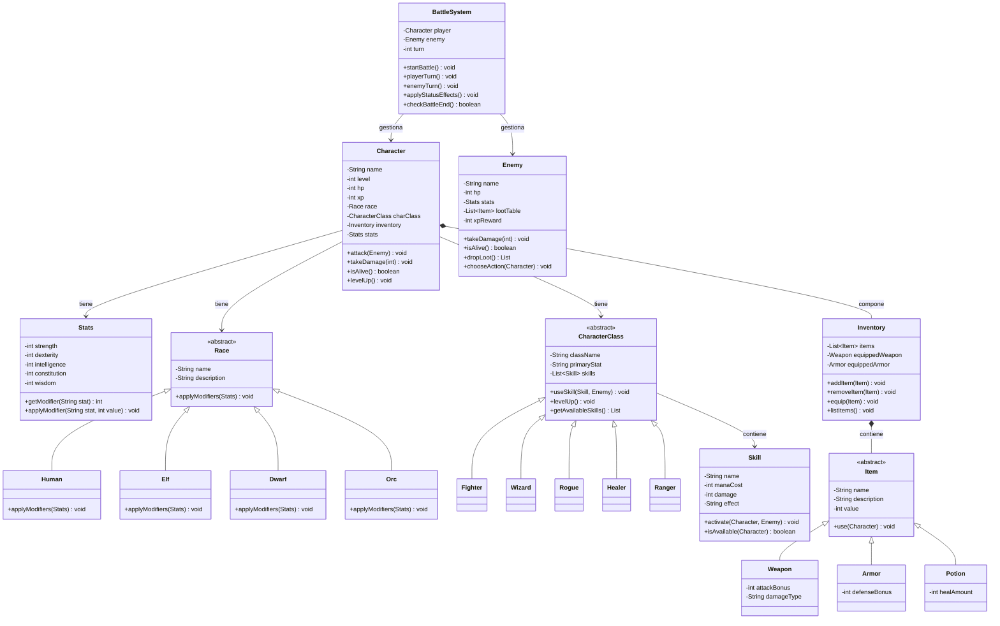

```
╔═════════════════════════════════════════════════════════════════╗
║                                                                 ║
║ ██████╗ ██████╗ ██╗███╗   ███╗██╗████████╗██╗██╗   ██╗ ██████╗  ║
║ ██╔══██╗██╔══██╗██║████╗ ████║██║╚══██╔══╝██║██║   ██║██╔═══██╗ ║
║ ██████╔╝██████╔╝██║██╔████╔██║██║   ██║   ██║██║   ██║██║   ██║ ║
║ ██╔═══╝ ██╔══██╗██║██║╚██╔╝██║██║   ██║   ██║╚██╗ ██╔╝██║   ██║ ║
║ ██║     ██║  ██║██║██║ ╚═╝ ██║██║   ██║   ██║ ╚████╔╝ ╚██████╔╝ ║
║ ╚═╝     ╚═╝  ╚═╝╚═╝╚═╝     ╚═╝╚═╝   ╚═╝   ╚═╝  ╚═══╝   ╚═════╝  ║
║                                                                 ║
║             A simple CLI based RPG · Matias Clemenzo            ║
║                                                                 ║
╚═════════════════════════════════════════════════════════════════╝

```

## Descripción general

Primitivo es un RPG de consola en el que el jugador crea un personaje eligiendo su **raza** y su **clase**, y lo lleva a través de combates por turnos contra enemigos. El foco del juego está en la **gestión del personaje**: su inventario, sus stats, sus habilidades y cómo estos elementos interactúan entre sí durante el combate.

No tiene interfaz gráfica. Toda la interacción es a través de texto en consola.

---

## Mecánicas principales

### Creación de personaje
El jugador elige:
- Una **raza** (Human, Elf, Dwarf, Orc) — cada una aplica modificadores positivos y negativos a los stats base
- Una **clase** (Fighter, Wizard, Rogue, Healer, Ranger) — define las habilidades disponibles y el stat principal que escala con el nivel

La combinación de raza y clase produce un personaje único con un perfil de stats diferente. Un Elfo Mago y un Enano Mago comparten clase, pero sus stats base difieren por la raza.

### Stats
Cada personaje tiene los siguientes atributos base, modificados por raza y equipamiento:

| Stat | Descripción |
|---|---|
| `STR` (Strength) | Daño físico |
| `DEX` (Dexterity) | Iniciativa y evasión |
| `INT` (Intelligence) | Poder mágico |
| `CON` (Constitution) | Puntos de vida máximos |
| `WIS` (Wisdom) | Resistencia a efectos de estado |

### Combate por turnos
- El orden de turno se determina por `DEX + d20` (dado de 20 caras)
- En su turno, el jugador puede: **atacar**, **usar una habilidad**, **usar un ítem** o **huir**
- El enemigo actúa con IA simple: selecciona acciones según su estado (HP, habilidades disponibles)
- Al final de cada turno completo se aplican efectos de estado (veneno, regeneración, etc.)
- El combate termina cuando uno de los dos llega a 0 HP

### Inventario
- El personaje lleva una mochila con capacidad limitada de ítems
- Los ítems se dividen en: **Weapon** (arma), **Armor** (armadura) y **Potion** (consumible)
- Equipar un arma o armadura modifica los stats del personaje en tiempo real
- Los enemigos derrotados pueden dejar loot

### Progresión
- Al ganar combates el personaje obtiene experiencia (XP)
- Al acumular suficiente XP sube de nivel, lo que mejora sus stats y puede desbloquear nuevas habilidades

---

## Alcance v1.0

Lo que **sí** pretende incluir la primera versión:

- Creación de personaje con elección de raza y clase
- Sistema de stats con modificadores por raza y equipamiento
- Combate por turnos contra un enemigo a la vez
- Inventario con ítems equipables y consumibles
- Sistema de habilidades por clase
- Efectos de estado básicos (veneno, regeneración)
- Progresión por XP y niveles

---

## ULM

El diagrama muestra las clases principales del sistema y sus relaciones. Las flechas con triángulo hueco indican **herencia**, las flechas simples indican **asociación** y el rombo indica **composición**.



---

## Conceptos de POO aplicados

| Concepto | Dónde se aplica |
|---|---|
| **Clases y objetos** | Cada entidad del juego (personaje, enemigo, ítem) es una clase |
| **Encapsulamiento** | Los atributos son `private`, accesibles solo mediante métodos |
| **Herencia** | `Race` y `CharacterClass` son abstractas; las razas y clases concretas las extienden |
| **Polimorfismo** | `applyModifiers()` se comporta distinto según la raza; `use()` distinto según el ítem |
| **Composición** | `Character` contiene un `Inventory`; `Inventory` contiene `Item`s |

---

## Tecnologías

- Java 21.0.10 / Maven 3.9.14
- Consola (Wezterm)/ Scanner para input
- GIT / Github
- VS Code
- API: [D&D 5e SRD API](https://5e-bits.github.io/docs/)

---

## Estado del proyecto

🚧 En desarrollo — diseño de clases en curso.
